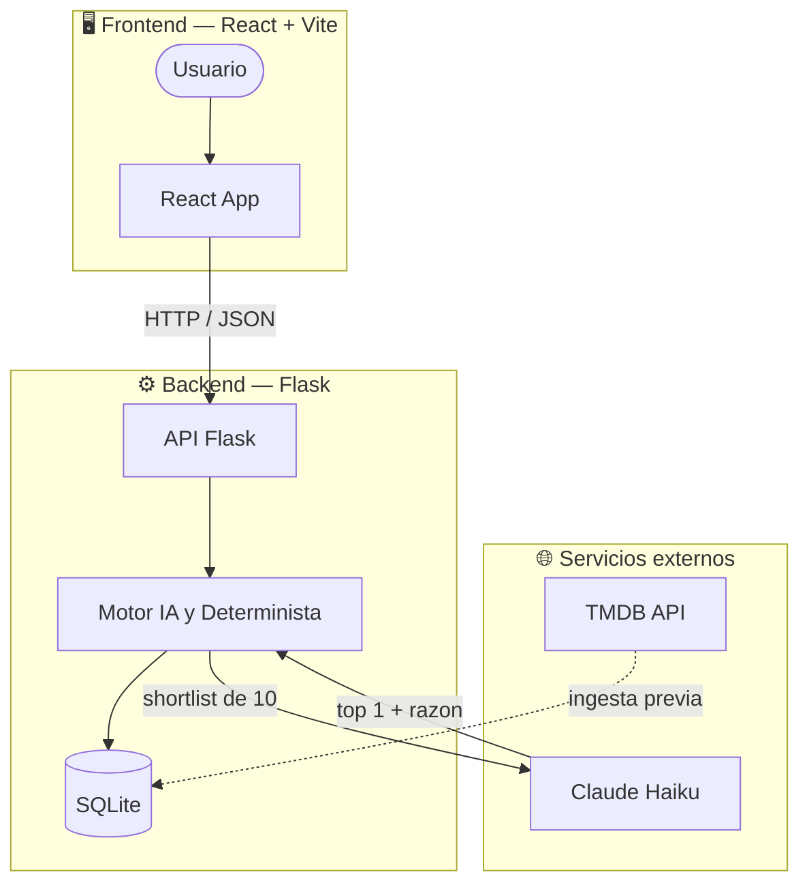
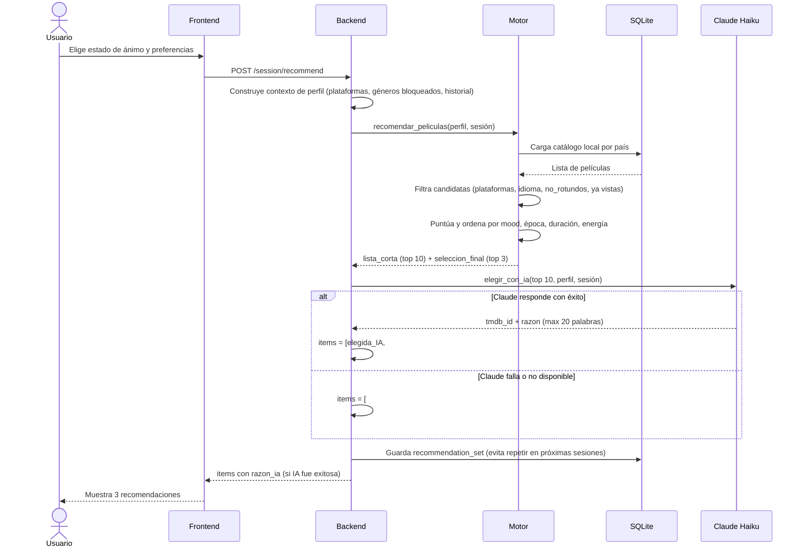

# MoodFix

MoodFix es un recomendador de peliculas para reducir fatiga de decision. TMDb actua como fuente de datos y Mood Radar como logica propia del sistema.

---

## Equipo

| Nombre | GitHub | Rol |
|---|---|---|
| **Juan Rivero** | [@riverohj](https://github.com/riverohj) | Tech Lead · Arquitectura · Backend · Gestión de PRs |
| **Jose Angel Rodriguez Montilla** | [@rodriguezmontillajose39-dotcom](https://github.com/rodriguezmontillajose39-dotcom) | Backend · Auth · Perfil de usuario · Integración |
| **Lourdes Miranda** | [@lourdescoronela](https://github.com/lourdescoronela) | Frontend · Motor IA · Sesiones · Historial · UX |
| **Burcu Cukurluoz** | [@burcuc-tech](https://github.com/burcuc-tech) | UI/UX Design · Pantallas de auth · Favoritos · Responsive |

### Contribuciones por persona

**Juan Rivero** arrancó el proyecto desde cero: configuró el boilerplate full stack, definió todos los contratos de épicas (docs/contracts/), implementó la ingesta del catálogo TMDB (Epic 1), construyó el motor determinista de recomendación (Epic 4), desarrolló las pantallas de sesión y gestionó la mayoría de los merges y PRs del equipo.

**Jose Angel Rodriguez Montilla** lideró el backend de autenticación y perfil de usuario (Epic 2), realizó el refactor del backend para simplificar la arquitectura, conectó el frontend con la API real y trabajó en la integración final del stack completo.

**Lourdes Miranda** construyó la mayor parte del frontend funcional: rediseñó la landing page con animaciones, implementó la persistencia de acciones de sesión (Epic 4), la memoria de recommendation sets (Epic 5), la integración con Claude Haiku para recomendaciones con IA (Epic 6), el historial y el pulido de navbar/footer.

**Burcu Cukurluoz** diseñó e implementó las pantallas de login/registro, la thank-you page, la vista de favoritos, alineó las pantallas de favoritos e historial, y realizó el pulido responsive final en todo el frontend.

---

## La idea

### Problema que resuelve

Abrir Netflix y quedarse 20 minutos buscando qué ver. La fatiga de decisión frente a un catálogo infinito hace que muchas veces se termine viendo algo ya visto o nada en absoluto.

### Solución

MoodFix es un recomendador de películas guiado por el estado de ánimo. En lugar de mostrar un catálogo, hace unas pocas preguntas sobre cómo se siente el usuario en ese momento y devuelve **3 películas concretas**, personalizadas a su perfil y a su estado actual.

### Cómo funciona

1. El usuario crea un perfil respondiendo preguntas de onboarding (géneros, actores, décadas preferidas, lo que no quiere ver).
2. Al iniciar una sesión elige entre "Sorpréndeme" (modo rápido) o "Pregúntame" (modo guiado con preguntas de estado de ánimo).
3. Un **motor determinista** filtra el catálogo local (TMDB) por compatibilidad con el perfil y construye una shortlist de 10 películas.
4. **Claude Haiku (Anthropic)** elige la mejor opción de esa shortlist y genera una razón personalizada para el usuario.
5. El usuario ve las 3 recomendaciones, puede guardarlas en favoritos, marcarlas como vistas, o pedir nuevas.

El sistema aprende de las sesiones anteriores excluyendo recommendation sets ya vistos, evitando repeticiones.

---

## Arquitectura del sistema



## Flujo de una recomendación



---

Este repositorio arranca con un boilerplate full stack sencillo:

- `frontend/`: app React con Vite
- `backend/`: API Flask
- `docs/`: cuaderno de ruta, decisiones y seguimiento

## Objetivo de esta base

La base ya no es solo boilerplate. A dia de hoy incluye catalogo local validado, backend comun para el equipo y la integracion en curso del onboarding estable con auth y perfil.

## Estructura

```text
.
├── backend/
├── docs/
├── frontend/
└── README.md
```

## Arranque local

### Backend

```bash
cp .env.example .env
cd backend
python3 -m venv .venv
source .venv/bin/activate
pip install -r requirements.txt
python run.py
```

Por defecto el backend arranca en modo estable, sin `debug` ni `reloader`.
Si alguien necesita debug local en su propia maquina, puede activar `FLASK_DEBUG=1`.

La configuracion del backend vive en el `.env` de la raiz del repo.

### Frontend

```bash
cd frontend
cp .env.example .env.local
npm install
npm run dev
```

La configuracion del frontend vive en `frontend/.env.local`.
Por defecto la app trabaja contra su propio backend local:

```bash
VITE_API_BASE_URL=http://localhost:5001/api
```

Importante:

- `localhost` siempre significa "mi propio ordenador"
- si Jose abre la app en su Mac, `http://localhost:5001/api` apunta al backend de Jose, no al de Juan
- para trabajar en equipo, lo recomendado es que cada persona tenga su propio backend y su propia BD local

Si alguien necesita pegar temporalmente al backend de otra persona para una demo o una revision puntual, puede cambiar `frontend/.env.local` a algo como:

```bash
VITE_API_BASE_URL=http://192.168.1.67:5001/api
```

El backend que recibe conexiones externas debe arrancar en `0.0.0.0`, que ya es el valor por defecto actual.

## Convenciones de trabajo

- Ramas cortas por tarea: `feat/...`, `fix/...`, `docs/...`, `chore/...`
- Commits con `Conventional Commits`
- Decisiones importantes en `docs/decisions.md`
- Progreso y bloqueos en `docs/progress-log.md`

## URL inicial de la API

La URL base inicial del backend es:

`http://localhost:5001/api`

Endpoint de comprobacion:

`http://localhost:5001/api/health`

Endpoint de comprobacion de base de datos:

`http://localhost:5001/api/db/status`

Endpoint minimo de consulta de catalogo:

`http://localhost:5001/api/movies?page=1&limit=20`

## Siguientes pasos

1. Mergear EPIC 2 backend auth y perfil en `main`.
2. Validar la integracion real del onboarding frontend contra la API.
3. Cerrar EPIC 2 con flujo completo de registro o login, onboarding y re-edicion.
4. Pasar despues a EPIC 3 para preguntas de sesion y handoff guest -> autenticado.

