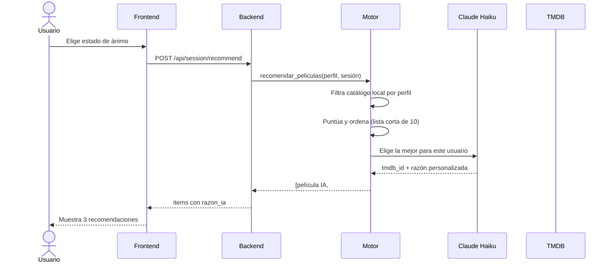

# MoodFix

MoodFix es un recomendador de peliculas para reducir fatiga de decision. TMDb actua como fuente de datos y Mood Radar como logica propia del sistema.

Este repositorio arranca con un boilerplate full stack sencillo:

- `frontend/`: app React con Vite
- `backend/`: API Flask
- `docs/`: cuaderno de ruta, decisiones y seguimiento

## Objetivo de esta base

La base ya no es solo boilerplate. A dia de hoy incluye catalogo local validado, backend comun para el equipo y la integracion en curso del onboarding estable con auth y perfil.

## Estructura

```text
.
├── backend/
├── docs/
├── frontend/
└── README.md
```

## Arranque local

### Backend

```bash
cp .env.example .env
cd backend
python3 -m venv .venv
source .venv/bin/activate
pip install -r requirements.txt
python run.py
```

Por defecto el backend arranca en modo estable, sin `debug` ni `reloader`.
Si alguien necesita debug local en su propia maquina, puede activar `FLASK_DEBUG=1`.

La configuracion del backend vive en el `.env` de la raiz del repo.

### Frontend

```bash
cd frontend
cp .env.example .env.local
npm install
npm run dev
```

La configuracion del frontend vive en `frontend/.env.local`.
Por defecto la app trabaja contra su propio backend local:

```bash
VITE_API_BASE_URL=http://localhost:5001/api
```

Importante:

- `localhost` siempre significa "mi propio ordenador"
- si Jose abre la app en su Mac, `http://localhost:5001/api` apunta al backend de Jose, no al de Juan
- para trabajar en equipo, lo recomendado es que cada persona tenga su propio backend y su propia BD local

Si alguien necesita pegar temporalmente al backend de otra persona para una demo o una revision puntual, puede cambiar `frontend/.env.local` a algo como:

```bash
VITE_API_BASE_URL=http://192.168.1.67:5001/api
```

El backend que recibe conexiones externas debe arrancar en `0.0.0.0`, que ya es el valor por defecto actual.

## Convenciones de trabajo

- Ramas cortas por tarea: `feat/...`, `fix/...`, `docs/...`, `chore/...`
- Commits con `Conventional Commits`
- Decisiones importantes en `docs/decisions.md`
- Progreso y bloqueos en `docs/progress-log.md`

## URL inicial de la API

La URL base inicial del backend es:

`http://localhost:5001/api`

Endpoint de comprobacion:

`http://localhost:5001/api/health`

Endpoint de comprobacion de base de datos:

`http://localhost:5001/api/db/status`

Endpoint minimo de consulta de catalogo:

`http://localhost:5001/api/movies?page=1&limit=20`

## Siguientes pasos

1. Mergear EPIC 2 backend auth y perfil en `main`.
2. Validar la integracion real del onboarding frontend contra la API.
3. Cerrar EPIC 2 con flujo completo de registro o login, onboarding y re-edicion.
4. Pasar despues a EPIC 3 para preguntas de sesion y handoff guest -> autenticado.

---

## Diagrama de arquitectura


## Flujo de una recomendación


